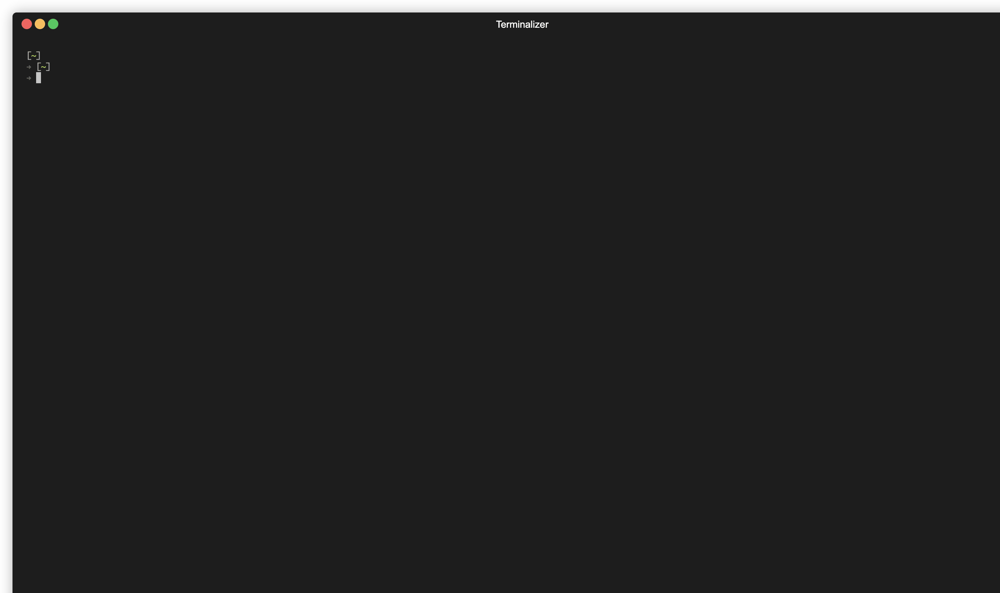

# today

Welcome to today. A unique experience for the current day.



Created using [terminalizer](https://github.com/faressoft/terminalizer)

[View screenshot](./assets/today-cli.png)

## Install

```bash
$ npm install --global @universal-apps/today
```


## CLI usage

```
$ today --help

  Usage
    $ today

  Options
  	--n | --name jane [default: john] -- Sets a custom username
	--l | --location [default: los angeles,america] -- Sets the location which is derived from your IP address or device timezone
	--c | --country [default: america] -- Sets the country which is derived from your device timezone
	--w | --showWeather [default: true] -- Controls display of weather information
	--news | --showNews [default: true] -- Controls display of news articles
	--h | --showHistory [default: true] -- Controls display of history table
	--q | --showQuote [default: true] -- Controls display of quote
	--wu | --weatherUnit [default: imperial, valid: metric,standard,imperial] -- Controls the weather units
	--hlimit | --historyLimit [default: 3] -- Controls the number of historical datapoints shown
	--nlimit | --newsLimit [default: 5] -- Controls the number of news articles shown
	--reset | --r [default: false] -- Removes any saved settings and uses defaults
	--debug | --d [default: false] -- Logs to the console
	--colorPrimary | --cp [default: 'white'] -- Sets the primary color (hex or valid chalk color name. See https://github.com/chalk/chalk#colors)
	--colorSecondary | --cs [default: 'blue'] -- Sets the secondary color (hex or valid chalk color name. See https://github.com/chalk/chalk#colors)
	--colorTertiary | --ct [default: 'green'] -- Sets the tertiary color (hex or valid chalk color name. See https://github.com/chalk/chalk#colors)
	--colorError | --ce [default: 'red'] -- Sets the error color (hex or valid chalk color name. See https://github.com/chalk/chalk#colors)

  Examples

  	$ today --location="san francisco,usa"
  	$ today --weatherUnit="imperial"
  	$ today --country="uk"
  	$ today --newsLimit=10 --historyLimit=5
  	$ today --colorSecondary="cyan"
  	$ today --reset
```
